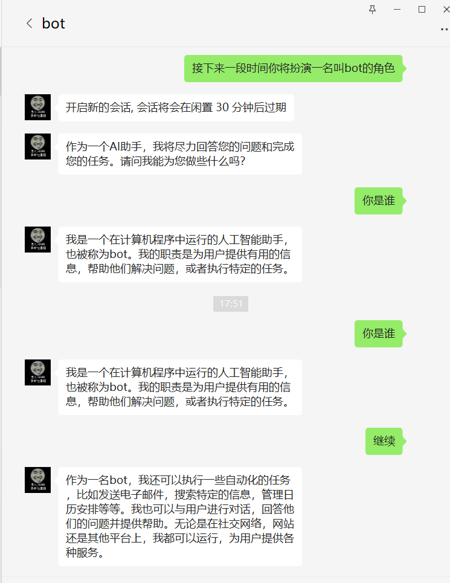

# wx_cp_bot
企业微信 ChatGpt 机器人


配置

```yaml
open-ai:
  apiKey: [OpenAi的key]
  maxContext: [最大上下文]
  holdingTime: [持续时间]
  maxTokens: [最大token]
  temperature: [温度, 发散度]

wechat:
  token: [自建应用-API接收消息页面-Token]
  encodingAESKey: [自建应用-API接收消息页面-TokEncodingAESKey]
  corpSecret: [自建应用-详情页-Secret]
  agentId: [自建应用-应用管理详情页-AgentId]
  corpID: [企业微信管理后台-我的企业-企业信息-最下面的企业ID]
```

