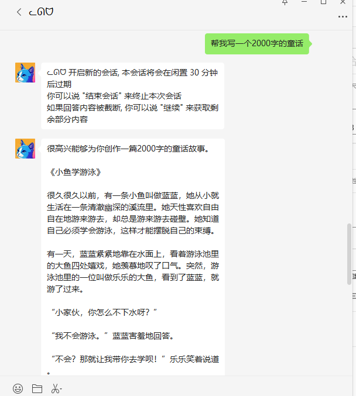
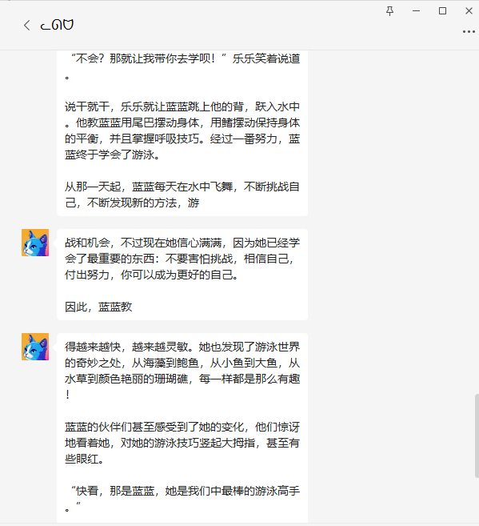

# wx_cp_bot
企业微信 ChatGpt 机器人


配置

```yaml
open-ai:
  apiKey: [OpenAi的key]
  maxContext: [最大上下文]
  holdingTime: [持续时间]
  maxTokens: [最大token]
  temperature: [温度, 发散度]
  model: [目前只有GPT_3_5_TURBO]

wechat:
  cp:
    token: [自建应用-API接收消息页面-Token]
    encodingAESKey: [自建应用-API接收消息页面-TokEncodingAESKey]
    corpSecret: [自建应用-详情页-Secret]
    agentId: [自建应用-应用管理详情页-AgentId]
    corpID: [企业微信管理后台-我的企业-企业信息-最下面的企业ID]
    messageLength: [单个消息字节数, 默认为1024, 不要超过2047]
    waitTime: [消息间延迟时间, 当返回消息拆成多条消息时, 如果不增加延迟可能微信收到消息顺序会错乱]
```


